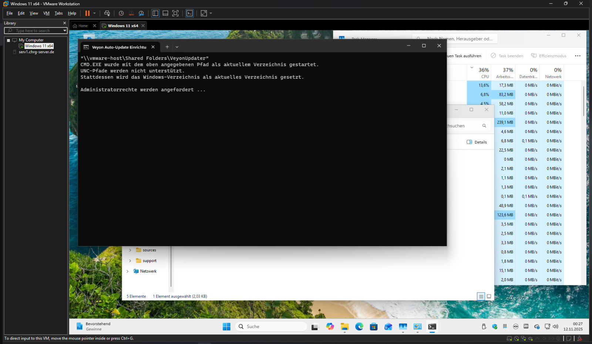
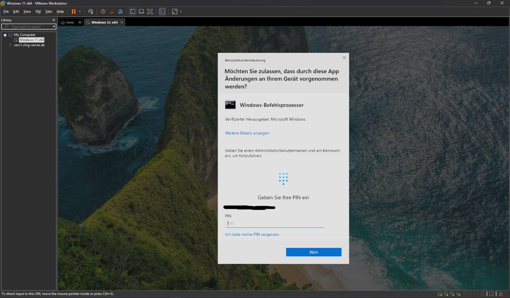
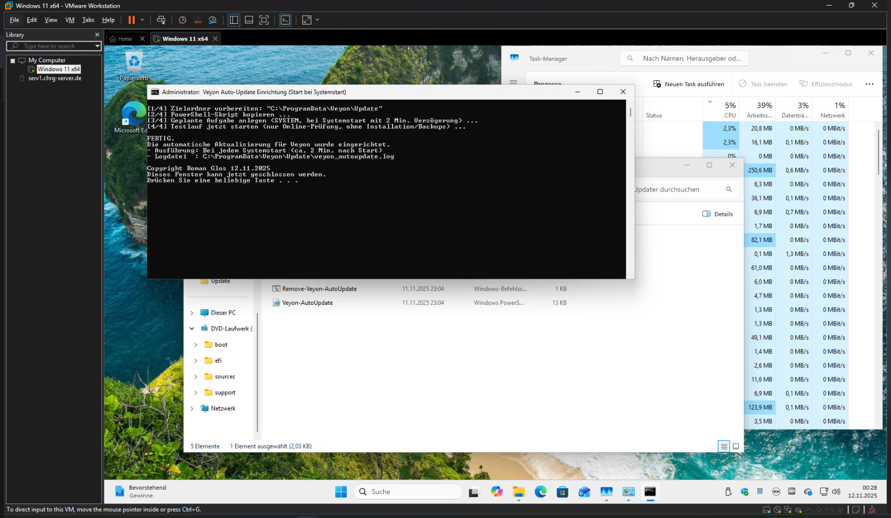
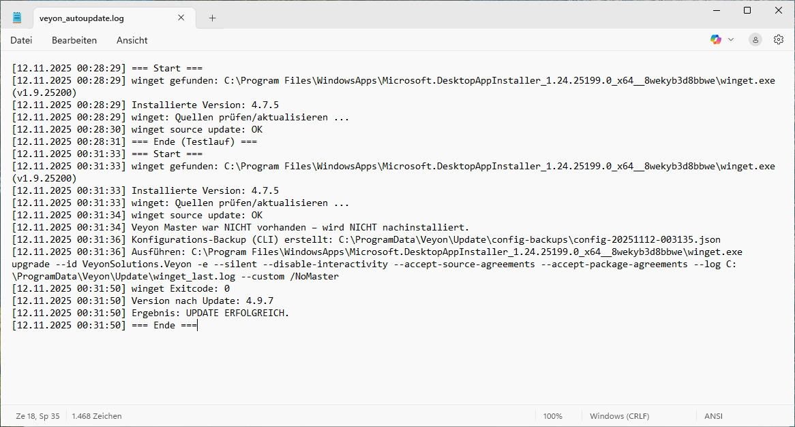

# Veyon Auto-Update (WinGet) – Start bei Systemstart

Automatisiert Updates von **Veyon** über **WinGet** beim **Systemstart** – leise, robust und mit Sicherung der bestehenden Konfiguration. Ideal für Eltern-/Schülergeräte, wo Standardkonten ohne Adminrechte genutzt werden.

> **Hinweis:** Dieses Repository stellt ein fertig nutzbares ZIP aus den Releases bereit. Es ändert **keine** Veyon-Einstellungen, aber übernimmt vorhandene Konfigurationen.

---
Wichtig: Es gibt zwei Installationswege
- Empfohlen: **Installation per EXE Datei** aus den Releases (Ein Klick Installer, am einfachsten für Eltern)
- Alternativ: **Installation per ZIP Datei** aus den Releases (ZIP entpacken und CMD als Administrator starten)

## Changelog

### V1.2 (30.01.2026)
- Neu: Ein Klick Installer als **EXE** (Eltern bitte diesen Weg nutzen)
- Installation vereinfacht: kein manuelles Entpacken und kein manuelles Starten der CMD nötig

### V1.1 (24.01.2026)
- Verbesserte Stabilität bei der Installation (u. a. Vorbereitung für bessere Handhabung durch Eltern).
- README überarbeitet und Hinweise zur korrekten Installation (Entpacken) ergänzt.

### V1.0 (12.11.2025)
- Erste Veröffentlichung.
- Einrichtung eines geplanten Tasks (SYSTEM) mit Start bei Systemstart (+ ca. 2 Min. Verzögerung).
- Logging nach `C:\ProgramData\Veyon\Update\veyon_autoupdate.log`

---

## Features

- **Update nur bei echter neuer Version**  
  Ermittelt die Online-Version über `winget show` und vergleicht sie numerisch mit der lokal installierten Version. Nur wenn **Online > Lokal**, wird ein Upgrade ausgeführt.

- **Sauberes Upgrade (silent)**
  - Nutzt `winget upgrade VeyonSolutions.Veyon` mit `--silent`, `--disable-interactivity` sowie den Lizenz-Flags.  
  - Wenn **kein Veyon Master** installiert war, wird er **nicht** nachinstalliert: das Skript hängt **`/NoMaster`** über `--custom` an (Silent-Argumente aus dem Manifest bleiben erhalten).

- **Konfig-Backup nur bei Update**  
  Vor dem Upgrade wird **genau ein** Backup erstellt (Primär: `veyon-cli config export` JSON; Fallback: Registry-Export).  
  **Rotation:** Es bleiben automatisch die **letzten 3** Backups.

- **Start über geplante Aufgabe (SYSTEM)**  
  Geplante Aufgabe läuft als **SYSTEM** mit **ca. 2 Minuten Verzögerung**.  
  Standard: **bei Systemstart**.  
  Optional/automatisch: **bei Benutzeranmeldung**, falls **Windows Schnellstart (Hybrid Shutdown)** aktiv ist (damit der Trigger zuverlässig greift). :contentReference[oaicite:0]{index=0}

- **Deutsches Log + Auto-Trimming**  
  Log: `C:\ProgramData\Veyon\Update\veyon_autoupdate.log` (deutsches Datumsformat). Ab ~1 MB werden ältere Einträge abgeschnitten; der letzte Lauf bleibt erhalten.

- **Idempotent & unbeaufsichtigt**  
  Bei „bereits aktuell“: **kein** Backup, **kein** Upgrade, **keine** UI.

---

## Systemvoraussetzungen

- Windows 10/11 mit **App Installer / WinGet**.
- Veyon 4.x/4.9.x (Master optional). Der Veyon-Installer unterstützt Silent-Install (`/S`) und Komponenten-Schalter (z. B. `/NoMaster`).

---

## Installation (per EXE Datei) – für Eltern (empfohlen)

1. In den Releases die Datei **`VeyonUpdater_vX_Y_Setup.exe`** herunterladen
2. Datei starten (bei Bedarf: Rechtsklick, **Als Administrator ausführen**)
3. Hinweis bestätigen, Setup entpackt und installiert automatisch
4. Fertig: Beim nächsten Start prüft das System die Online Version und aktualisiert nur wenn nötig

Tipp: Nach der Installation kann man den Task in der Aufgabenplanung sehen (Name z. B. „Veyon AutoUpdate (winget)“).

## Installation (per ZIP Datei) – alternativ

1. ZIP aus den Releases herunterladen
2. Wichtig: ZIP **entpacken** (Rechtsklick → **Alle extrahieren**)
   Hintergrund: Aus einer geöffneten ZIP heraus blockiert Windows teils Schreib und Ausführrechte („Zugriff verweigert“)
3. Als Administrator `Install-Veyon-AutoUpdate.cmd` starten  
   Kopiert Dateien nach `C:\ProgramData\Veyon\Update\`  
   Legt eine geplante Aufgabe an (SYSTEM, Delay ca. 2 Minuten)
4. Fertig: Beim nächsten Start prüft das Skript die Online Version und aktualisiert nur wenn nötig

Tipp: Nach der Installation kann man den Task in der Aufgabenplanung sehen (Name z. B. „Veyon AutoUpdate (winget)“).

### Deinstallation
`Remove-Veyon-AutoUpdate.cmd` als Administrator ausführen (Aufgabe + Dateien werden entfernt).

---

## Ordner/Dateien

- `Install-Veyon-AutoUpdate.cmd`  
  Einrichtung: Kopieren + Task anlegen (fragt Adminrechte an).
- `Veyon-AutoUpdate.ps1`  
  Führt die Online-Prüfung und ggf. das Update durch (liegt danach unter `C:\ProgramData\Veyon\Update\`).
- `Remove-Veyon-AutoUpdate.cmd`  
  Entfernt Task und Dateien.
- `README.md` / Screenshots  
  Anleitung + Bilder.

---

## Protokoll (Logfile)

- Log: `C:\ProgramData\Veyon\Update\veyon_autoupdate.log`

Wenn WinGet fehlt/defekt ist, versucht das Skript (je nach Implementierung) die Quelle zu aktualisieren bzw. WinGet wieder nutzbar zu machen. Falls das nicht gelingt: **„App Installer“** über Microsoft Store aktualisieren/installieren.

---

## Screenshots

### Schritt 1

### Schritt 2

### Schritt 3

### Logfile (Beispielausgabe)

---

## Wie es intern funktioniert (Kurz)

1. **WinGet-Quellen pflegen**: `winget source update` (bei Problemen ggf. Reset/Neu-Update).
2. **Online-Version ermitteln**: `winget show VeyonSolutions.Veyon -e` – Parsen der Zeile `Version: ...`.
3. **Entscheidung**: Nur wenn **Online > Lokal** →  
   a) **Konfig-Backup**,  
   b) `winget upgrade --id VeyonSolutions.Veyon -e --silent --disable-interactivity --accept-source-agreements --accept-package-agreements --log <Pfad>`  
   c) Falls vorher **kein Master** installiert war: `--custom "/NoMaster"` anhängen.
4. **Logging** inkl. Exitcodes; **Backup-Rotation (3)**; **Log-Trimming** ab 1 MB.

---

## FAQ

**Was, wenn während des Upgrades der PC ausgeschaltet wird?**  
Beim nächsten Start läuft die Prüfung erneut. Ist die Version noch alt, wird das Upgrade wieder ausgelöst. Mehrfache Aufrufe sind unkritisch.

**Warum ggf. „Benutzeranmeldung“ statt „Systemstart“ als Trigger?**  
Bei aktiviertem **Schnellstart** ist „Herunterfahren“ technisch eine Art Hybrid-Shutdown (Kernel-Session wird in eine Hibernation-Datei geschrieben). Dadurch kann ein „Einschalten“ eher einem Resume ähneln als einem klassischen Kaltstart – und Trigger-Verhalten kann sich unterscheiden. :contentReference[oaicite:1]{index=1}

---

## Haftungsausschluss

Benutzung auf eigene Verantwortung. Bitte vorherige Backups/Images vorhalten. Keine Garantie, keine Gewährleistung.

---

## Copyright

Copyright © Roman Glos, 12.11.2025–30.01.2026.  
Siehe **TERMS.md** für Nutzungsbedingungen.

